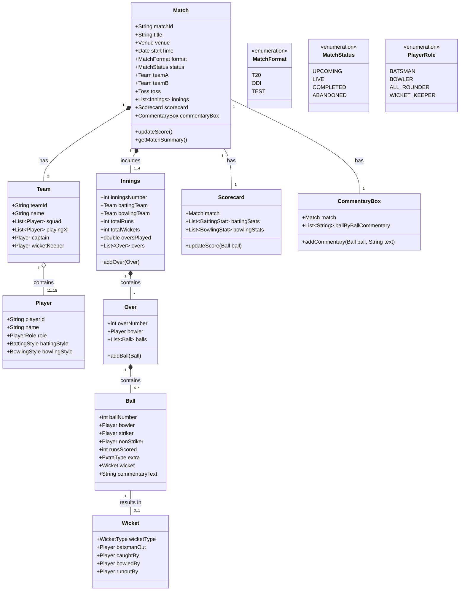

```mermaid
classDiagram
    class Match {
        +String matchId
        +String title
        +Venue venue
        +Date startTime
        +MatchFormat format
        +MatchStatus status
        +Team teamA
        +Team teamB
        +Toss toss
        +List~Innings~ innings
        +Scorecard scorecard
        +CommentaryBox commentaryBox
        +updateScore()
        +getMatchSummary()
    }

    class Team {
        +String teamId
        +String name
        +List~Player~ squad
        +List~Player~ playingXI
        +Player captain
        +Player wicketKeeper
    }

    class Player {
        +String playerId
        +String name
        +PlayerRole role
        +BattingStyle battingStyle
        +BowlingStyle bowlingStyle
    }

    class Innings {
        +int inningsNumber
        +Team battingTeam
        +Team bowlingTeam
        +int totalRuns
        +int totalWickets
        +double oversPlayed
        +List~Over~ overs
        +addOver(Over)
    }

    class Over {
        +int overNumber
        +Player bowler
        +List~Ball~ balls
        +addBall(Ball)
    }

    class Ball {
        +int ballNumber
        +Player bowler
        +Player striker
        +Player nonStriker
        +int runsScored
        +ExtraType extra
        +Wicket wicket
        +String commentaryText
    }

    class Scorecard {
        +Match match
        +List~BattingStat~ battingStats
        +List~BowlingStat~ bowlingStats
        +updateScore(Ball ball)
    }

    class CommentaryBox {
        +Match match
        +List~String~ ballByBallCommentary
        +addCommentary(Ball ball, String text)
    }

    class Wicket {
        +WicketType wicketType
        +Player batsmanOut
        +Player caughtBy
        +Player bowledBy
        +Player runoutBy
    }

    class MatchFormat {
        <<enumeration>>
        T20
        ODI
        TEST
    }

    class MatchStatus {
        <<enumeration>>
        UPCOMING
        LIVE
        COMPLETED
        ABANDONED
    }
    
    class PlayerRole {
        <<enumeration>>
        BATSMAN
        BOWLER
        ALL_ROUNDER
        WICKET_KEEPER
    }

    Match "1" *-- "2" Team : has
    Team "1" o-- "11..15" Player : contains
    Match "1" *-- "1..4" Innings : includes
    Innings "1" *-- "*" Over : contains
    Over "1" *-- "6..*" Ball : contains
    Match "1" -- "1" Scorecard : has
    Match "1" -- "1" CommentaryBox : has
    Ball "1" -- "0..1" Wicket : results in

```