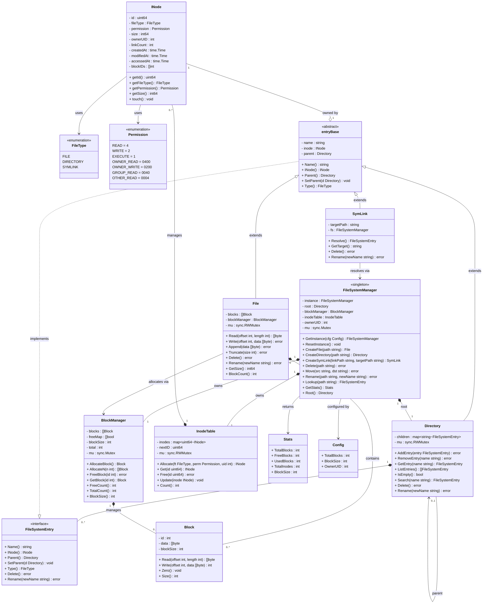

```mermaid
classDiagram
    direction TB

    %% ─── Enumerations ───────────────────────────────────────────

    class FileType {
        <<enumeration>>
        FILE
        DIRECTORY
        SYMLINK
    }

    class Permission {
        <<enumeration>>
        READ = 4
        WRITE = 2
        EXECUTE = 1
        OWNER_READ = 0400
        OWNER_WRITE = 0200
        GROUP_READ = 0040
        OTHER_READ = 0004
    }

    %% ─── INode ──────────────────────────────────────────────────

    class INode {
        - id : uint64
        - fileType : FileType
        - permission : Permission
        - size : int64
        - ownerUID : int
        - linkCount : int
        - createdAt : time.Time
        - modifiedAt : time.Time
        - accessedAt : time.Time
        - blockIDs : []int
        + getId() uint64
        + getFileType() FileType
        + getPermission() Permission
        + getSize() int64
        + touch() void
    }

    %% ─── FileSystemEntry (abstract) ─────────────────────────────

    class FileSystemEntry {
        <<interface>>
        + Name() string
        + INode() INode
        + Parent() Directory
        + SetParent(d Directory) void
        + Type() FileType
        + Delete() error
        + Rename(newName string) error
    }

    %% ─── entryBase (shared embed) ───────────────────────────────

    class entryBase {
        <<abstract>>
        - name : string
        - inode : INode
        - parent : Directory
        + Name() string
        + INode() INode
        + Parent() Directory
        + SetParent(d Directory) void
        + Type() FileType
    }

    %% ─── File ───────────────────────────────────────────────────

    class File {
        - blocks : []Block
        - blockManager : BlockManager
        - mu : sync.RWMutex
        + Read(offset int, length int) []byte
        + Write(offset int, data []byte) error
        + Append(data []byte) error
        + Truncate(size int) error
        + Delete() error
        + Rename(newName string) error
        + GetSize() int64
        + BlockCount() int
    }

    %% ─── Directory ──────────────────────────────────────────────

    class Directory {
        - children : map~string~FileSystemEntry~
        - mu : sync.RWMutex
        + AddEntry(entry FileSystemEntry) error
        + RemoveEntry(name string) error
        + GetEntry(name string) FileSystemEntry
        + ListEntries() []FileSystemEntry
        + IsEmpty() bool
        + Search(name string) FileSystemEntry
        + Delete() error
        + Rename(newName string) error
    }

    %% ─── SymLink ────────────────────────────────────────────────

    class SymLink {
        - targetPath : string
        - fs : FileSystemManager
        + Resolve() FileSystemEntry
        + GetTarget() string
        + Delete() error
        + Rename(newName string) error
    }

    %% ─── Block ──────────────────────────────────────────────────

    class Block {
        - id : int
        - data : []byte
        - blockSize : int
        + Read(offset int, length int) []byte
        + Write(offset int, data []byte) int
        + Zero() void
        + Size() int
    }

    %% ─── BlockManager ───────────────────────────────────────────

    class BlockManager {
        - blocks : []Block
        - freeMap : []bool
        - blockSize : int
        - total : int
        - mu : sync.Mutex
        + AllocateBlock() Block
        + AllocateN(n int) []Block
        + FreeBlock(id int) error
        + GetBlock(id int) Block
        + FreeCount() int
        + TotalCount() int
        + BlockSize() int
    }

    %% ─── InodeTable ─────────────────────────────────────────────

    class InodeTable {
        - inodes : map~uint64~INode~
        - nextID : uint64
        - mu : sync.RWMutex
        + Allocate(ft FileType, perm Permission, uid int) INode
        + Get(id uint64) INode
        + Free(id uint64) error
        + Update(inode INode) void
        + Count() int
    }

    %% ─── FileSystemManager (Singleton) ──────────────────────────

    class FileSystemManager {
        <<singleton>>
        - instance : FileSystemManager
        - root : Directory
        - blockManager : BlockManager
        - inodeTable : InodeTable
        - ownerUID : int
        - mu : sync.Mutex
        + GetInstance(cfg Config) FileSystemManager
        + ResetInstance() void
        + CreateFile(path string) File
        + CreateDirectory(path string) Directory
        + CreateSymLink(linkPath string, targetPath string) SymLink
        + Delete(path string) error
        + Move(src string, dst string) error
        + Rename(path string, newName string) error
        + Lookup(path string) FileSystemEntry
        + GetStats() Stats
        + Root() Directory
    }

    %% ─── Stats ──────────────────────────────────────────────────

    class Stats {
        + TotalBlocks : int
        + FreeBlocks : int
        + UsedBlocks : int
        + TotalInodes : int
        + BlockSize : int
    }

    %% ─── Config ─────────────────────────────────────────────────

    class Config {
        + TotalBlocks : int
        + BlockSize : int
        + OwnerUID : int
    }

    %% ═══════════════════════════════════════════════════════════
    %% RELATIONSHIPS
    %% ═══════════════════════════════════════════════════════════

    %% entryBase implements FileSystemEntry
    FileSystemEntry <|.. entryBase : implements

    %% Concrete types extend entryBase
    entryBase <|-- File        : extends
    entryBase <|-- Directory   : extends
    entryBase <|-- SymLink     : extends

    %% INode association
    INode "1" --o "1" entryBase       : owned by
    INode --> FileType                : uses
    INode --> Permission              : uses

    %% File uses Block
    File "1" *-- "0..*" Block         : contains

    %% Directory holds children (self-ref + entries)
    Directory "1" *-- "0..*" FileSystemEntry : contains
    Directory "0..1" --> Directory    : parent

    %% SymLink resolves via FSManager
    SymLink --> FileSystemManager     : resolves via

    %% FileSystemManager owns everything
    FileSystemManager "1" *-- "1" Directory    : root
    FileSystemManager "1" *-- "1" BlockManager : owns
    FileSystemManager "1" *-- "1" InodeTable   : owns
    FileSystemManager --> Stats                : returns
    FileSystemManager --> Config               : configured by

    %% BlockManager manages blocks
    BlockManager "1" *-- "0..*" Block   : manages

    %% InodeTable manages inodes
    InodeTable "1" *-- "0..*" INode     : manages

    %% File depends on BlockManager for alloc
    File --> BlockManager : allocates via
```