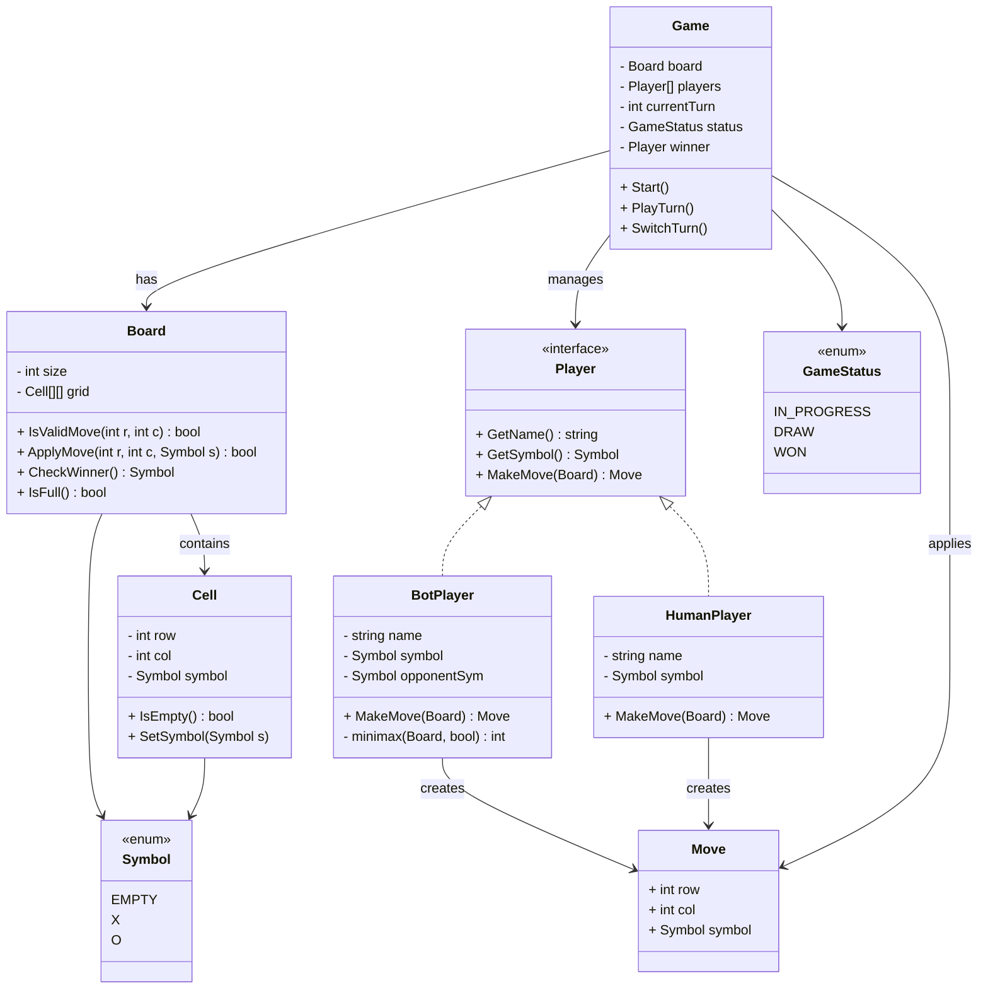

```mermaid
classDiagram

class Game {
  - Board board
  - Player[] players
  - int currentTurn
  - GameStatus status
  - Player winner
  + Start()
  + PlayTurn()
  + SwitchTurn()
}

class Board {
  - int size
  - Cell[][] grid
  + IsValidMove(int r, int c) bool
  + ApplyMove(int r, int c, Symbol s) bool
  + CheckWinner() Symbol
  + IsFull() bool
}

class Cell {
  - int row
  - int col
  - Symbol symbol
  + IsEmpty() bool
  + SetSymbol(Symbol s)
}

class Move {
  + int row
  + int col
  + Symbol symbol
}

class Player {
  <<interface>>
  + GetName() string
  + GetSymbol() Symbol
  + MakeMove(Board) Move
}

class HumanPlayer {
  - string name
  - Symbol symbol
  + MakeMove(Board) Move
}

class BotPlayer {
  - string name
  - Symbol symbol
  - Symbol opponentSym
  + MakeMove(Board) Move
  - minimax(Board, bool) int
}

class Symbol {
  <<enum>>
  EMPTY
  X
  O
}

class GameStatus {
  <<enum>>
  IN_PROGRESS
  DRAW
  WON
}

Game --> Board : has
Game --> Player : manages
Board --> Cell : contains
Player <|.. HumanPlayer
Player <|.. BotPlayer
BotPlayer --> Move : creates
HumanPlayer --> Move : creates
Game --> Move : applies
Board --> Symbol
Cell --> Symbol
Game --> GameStatus
```